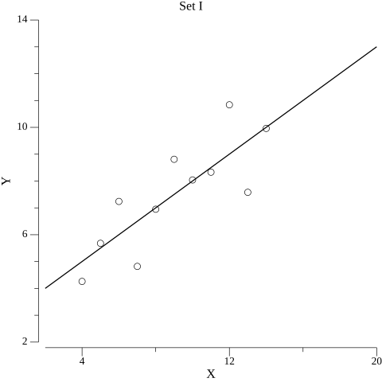
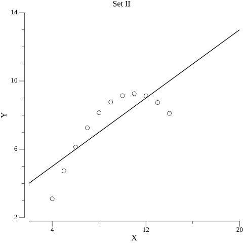
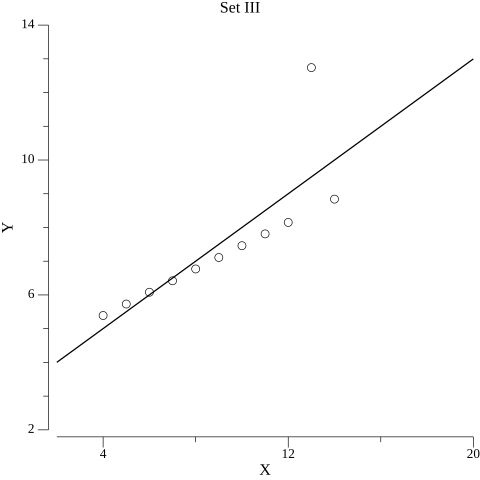
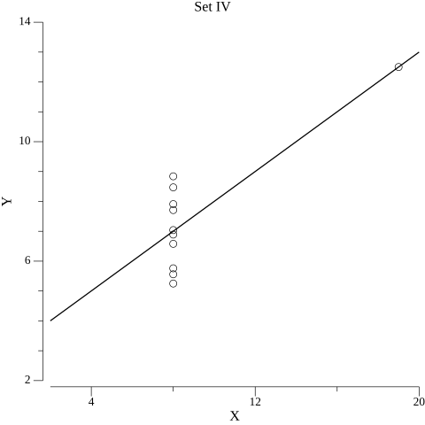
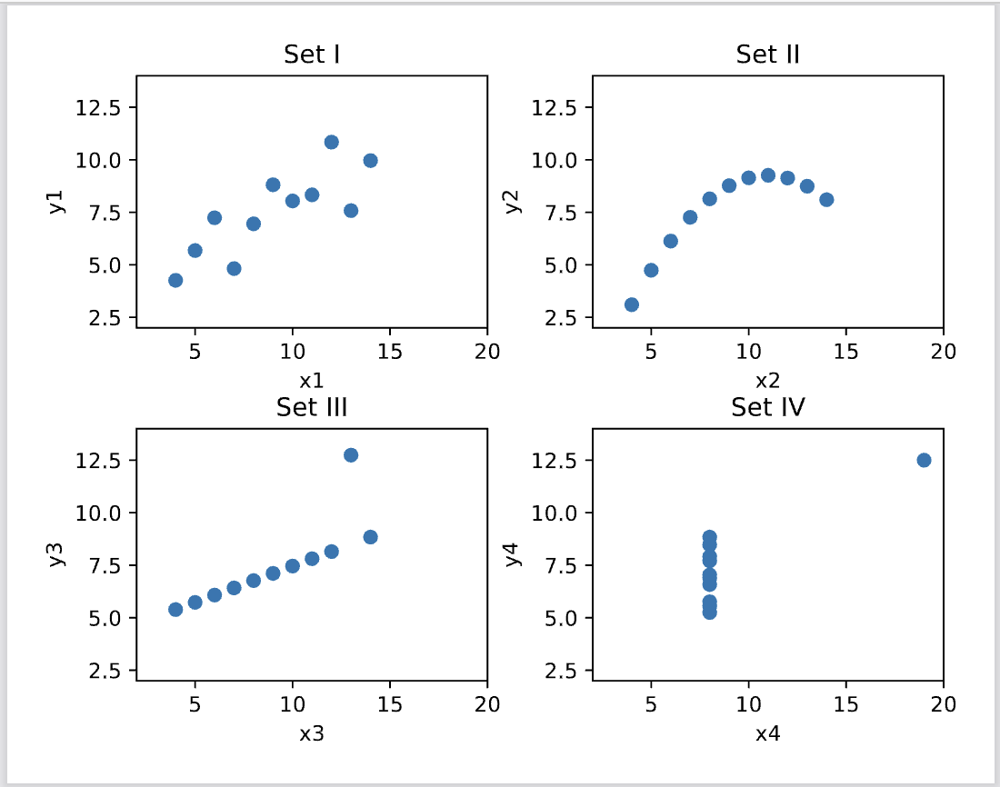
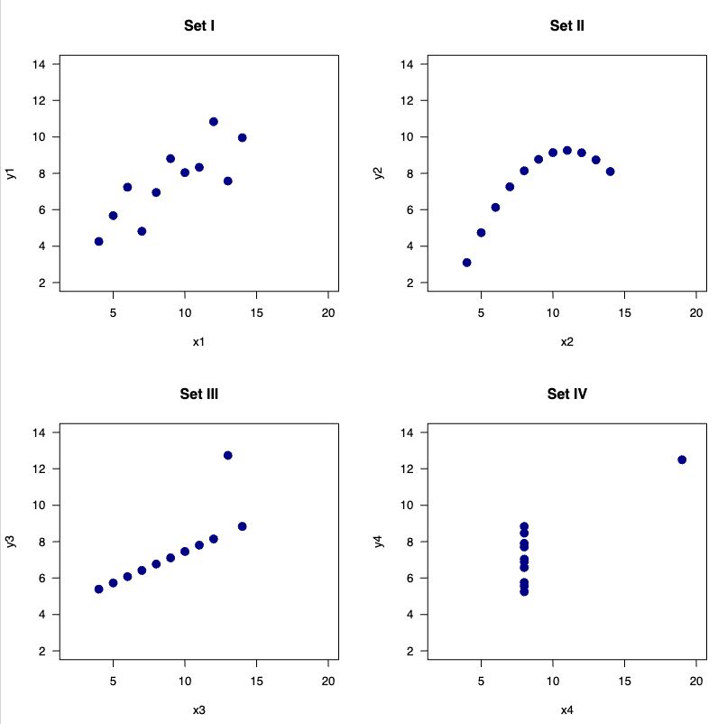

# README.md

# Anscombe Quartet regression analysis and performance comparison

---

## Project Overview

This project evaluates the ability of Go to perform basic statistical analysis (simple linear regression) on the Anscombe Quartet dataset.  
The objective is to validate whether Go's statistical packages can produce results comparable to traditional Python and R implementations, while also assessing program execution times and memory usage.


## Roles of Programs and Data

| Component | Role |
|:---|:---|
| `main.go` | Runs regression analysis using Go, plots results, measures execution time and memory usage |
| `main_test.go` | Unit tests and benchmark tests for Go regression functions |
| `miller-mtpa-chapter-1-program.py` | Python script to perform regression using statsmodels and generate plots |
| `miller-mtpa-chapter-1-program.R` | R script to perform regression using lm() and generate plots |
| Anscombe Dataset (hardcoded) | 4 small datasets (x1~x4, y1~y4) with identical linear regression properties despite differing distributions |


## How to Build and Use the Application (Go)

### Build the Executable
For Mac/Linux:
```bash
go build -o anscombe_app main.go
```
For Windows:
```bash
go build -o anscombe_app.exe main.go
```

### Run the Application
On Mac/Linux:
```bash
./anscombe_app
```
On Windows:
```bash
anscombe_app.exe
```
This repository already includes pre-built executables:

- `anscombe_app.exe` for Windows
- `anscombe_app` for macOS

**Outputs:**
- Prints regression results (slope, intercept, R-squared, Residual Std Error, F-statistic)
- Displays execution time and memory usage per set and overall
- Saves 4 grid plot as `anscombe_quartet_go.png`

No user input is required. The program executes automatically.


## How to Test the Application

Run unit tests and benchmark tests for Go (main_test.go):

```bash
go test
go test -bench=.
```

Tests include:
- Validation of linear regression function (`linearRegression`)
- Validation of regression metrics calculation (`regressionMetrics`)
- Benchmark measuring regression performance over multiple iterations


## Model Comparisons: Results, Execution Times, and Memory Used

### 1. Regression Result Consistency
Across all four datasets (Set I–IV), the R-squared values and F-statistics calculated using Go, Python, and R are highly consistent:

<p align="center">


</p>
<p align="center">


</p>
<p align="center">

</p>
<p align="center">

</p>

| Set | Go (R² / F-statistic / RSE) | Python (R² / F-statistic) | R (R² / F-statistic / RSE) |
|:---|:---|:---|:---|
| Set I | 0.6665 / 17.9899 / 1.2366 | 0.667 / 17.99 | 0.6665 / 17.99 / 1.237 |
| Set II | 0.6662 / 17.9656 / 1.2372 | 0.666 / 17.97 | 0.6662 / 17.97 / 1.237 |
| Set III | 0.6663 / 17.9723 / 1.2363 | 0.666 / 17.97 | 0.6663 / 17.97 / 1.236 |
| Set IV | 0.6667 / 18.0033 / 1.2357 | 0.667 / 18.00 | 0.6667 / 18.00 / 1.236 |

Additionally, the Residual Standard Error (RSE) calculated in Go (~1.236) matches closely with the R output (Residual standard error: 1.236 - 1.237).


Conclusion: Go's regression results are **nearly identical** to Python and R.


### 2. Program Execution Time and Memory Usage

| Metric | Go | Python | R |
|:---|:---|:---|:---|
| Total Execution Time | 18.208µs | 0.967014 seconds | 0.04441595 seconds |
| Total Memory Used | 0.87 KB | ~10,350 KB (current), ~11,595 KB (peak) | ~23.2 MB |

- Go demonstrates **significantly faster execution** and **extremely low memory usage** compared to Python and R.

**Execution Time:** 
Go demonstrates significantly faster execution compared to Python and R when running the Anscombe Quartet regressions.

Go completed all sets in less than 20 microseconds.

Python took about 1 second, R completed slightly faster at around 44 milliseconds.

**Memory Usage:**
Go is extremely memory-efficient (under 1 KB total), while Python and R consume substantially more memory (over 10 MB).


## Recommendation to Management

Based on the results:

- **Accuracy:**  
  Go's statistical package produces regression coefficients, R-squared values, residual errors, and F-statistics that are **statistically comparable** to those obtained with Python and R.

- **Performance:**  
  Go achieves **superior speed** and **minimal memory consumption**, making it ideal for backend analytics, lightweight applications, and distributed microservices.

- **Caution:**  
  Although Go is excellent for simple statistical tasks, Python and R still offer richer ecosystems for advanced statistical modeling (e.g., multivariate regression, time series, robust error estimation).

**Final Recommendation:**  
The company can confidently encourage data scientists to use Go for basic regression analysis and backend data tasks.  
For highly specialized or complex statistical modeling, Python or R should remain available.


## Reusable Modules

The following general-purpose Go functions were developed as part of this project and are reusable in other machine learning, statistical analysis, or data science projects:

- `linearRegression(x, y []float64) (slope, intercept float64, err error)`  
  Computes the simple linear regression coefficients for any two numeric variables.

- `regressionMetrics(x, y []float64, slope, intercept float64) (r2, rse, fstat float64)`  
  Calculates R-squared, residual standard error, and F-statistic for evaluating regression models.

These modules are independent, well-documented, and can be directly imported into future Go projects requiring regression analysis.

